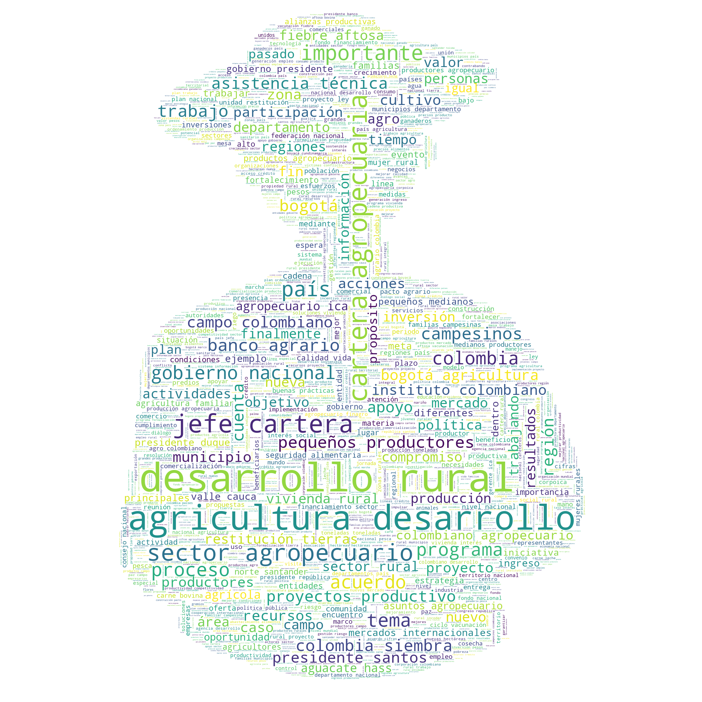
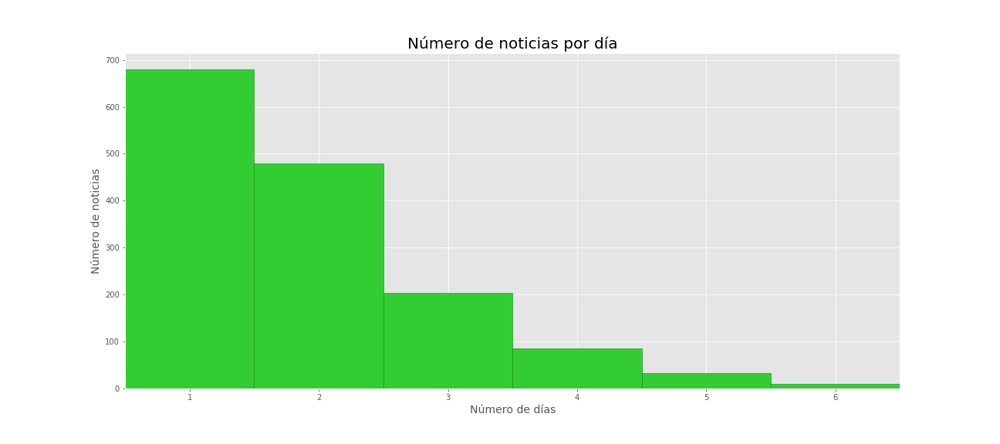
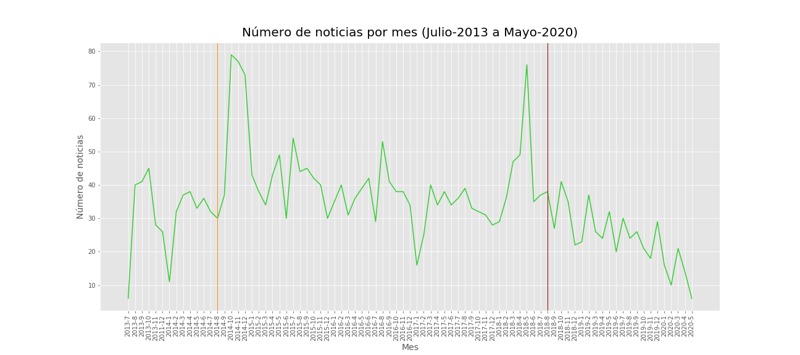
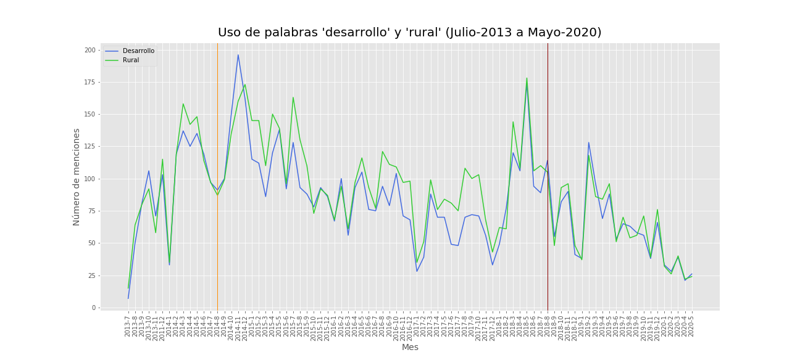
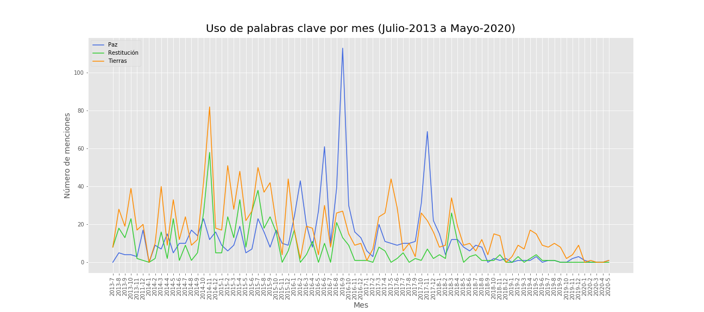
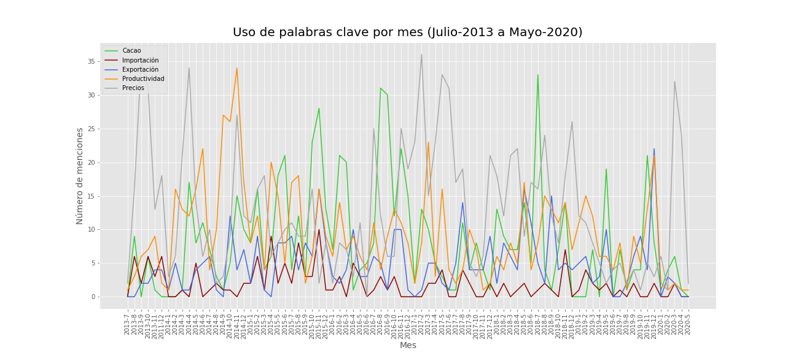
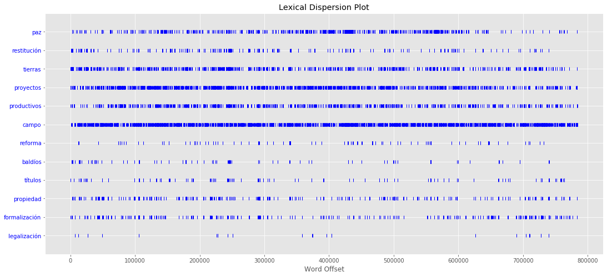
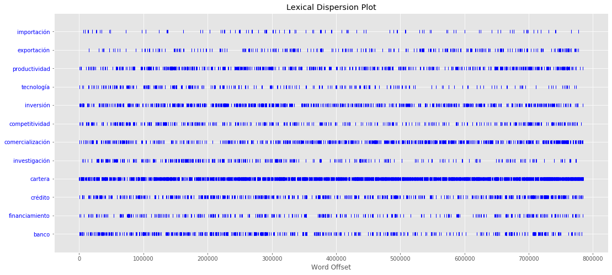

# Análisis de noticias del Ministerio de Agricultura y Desarrollo Rural (MADR) de Colombia

[Leonel Criado](https://twitter.com/Leocriadom)

22-Mayo-2020

---

## Descripción y motivación

La página del Ministerio de Agricultura y Desarrollo Rural (MADR) de Colombia cuenta con un repositorio histórico de noticias desde un poco antes de la reelección del expresidente Juan Manuel Santos en agosto de 2016. En este proyecto, utilizaré la técnica de web scrapping para capturar las noticias y luego analizarlas usando herramientas de análisis de texto en Python.

Algunas de las preguntas que motivaron este proyecto son:

- El expresidente Juan Manuel Santos firmó el tratado de paz con las FARC en 2016, en donde algunos de los puntos claves fue la restitución de tierras y el acompañamiento de las víctimas del conflicto con proyectos productivos. Sin embargo, con la posesión del presidente Iván Duque estos procesos no han avanzado de forma significativa. ¿Las noticias publicadas por MADR reflejan este retraso de alguna manera?
- ¿Cuál es la importancia relativa de los derechos de propiedad de la tierra, en términos de frecuencia de palabras claves, como adjudicación de terrenos baldíos, reforma rural, títulos de propiedad, restitución de tierras, formalización y legalización, etc.?
- ¿Cuáles han sido los subsectores agrícolas y cultivos más importantes, en términos de menciones de palabras claves, como importación, exportación, productividad, tecnología, inversión, etc.?
- ¿Cómo reflejan los datos eventos estacionales y específicos como choques climáticos y caídas en los precios de los commodities? 

## Métodos utilizados

1. Scraping:
    - El repositorio histórico de noticias del MADR se encuentra disponible en el siguiente sitio web:
    https://www.minagricultura.gov.co/noticias/SitePages/PrensaNoticias.aspx
    - Los links de las noticias fueron capturados usando las librerías 'Selenium' y 'Webdriver'.
    - La noticias y detalles adicionales fueron capturadas usando las librerías 'Request' y 'BeautifulSoup'.
    - El código de python para web scraping con Webdriver está disponible [aquí](scrape_code1.ipynb).
    - El código de python para web scraping con BeatifulSoup está disponible [aquí](scrape_code2.ipynb).
      
2. Extracción de la base de datos usando objetos de 'BeatifulSoup':
    - La extracción de los datos se realizó utilizando funciones de ayuda para obtener htmls, urls, fechas, ubicaciones, títulos y textos de las noticias. Asimismo, se usaron funciones para remover etiquetas y textos vacíos.
    - Funciones de ayuda para web scraping disponibles [aquí](scraper_helper.ipynb).
      
3. Organización y limpieza de la base de datos:
    - La captura de las noticias se realizó en dos batches debido al bloqueo de mi dirección IP y a mi conexión a internet. 
    - Los batches fueron unidos y limpiados usando métodos de 'Pandas', 'string' y expresiones regulares, entre otros.
    - El análisis de los datos fue hecho a partir de la librería 'Pandas', y la base de datos resultante fue exportada a un archivo 'pickle'.
    - La limpieza del texto de las noticias se realizó principalmente con las librerías 'string' y 'nltk', las cuales permiten eliminar la puntuación, palabras vacías, cambiar a minúsculas todas las palabras, tokenizar el texto, entre otras cosas.
    - Codigo de consolidación de la base de datos disponible [aquí](data_clean.ipynb).

## Hallazgos

El código para el análisis está disponible [aquí](news_analysis.ipynb).

La base de datos contiene noticias desde el 25 de julio de 2013 hasta el 18 de mayo de 2020.
- Número de noticias únicas del MADR: 2.886
- Número de días en el periodo de análisis: 2.489
- Número de días en los que al menos se publicó una noticia: 1.501
- Máximo número de noticias en un día: 11
- Porcentaje de días con al menos una noticia en el periodo de análisis: 60%

Algunas visualizaciones de hallazgos importantes:

La línea naranja indica el comienzo del segundo periodo presidencial del expresidente Juan Manuel Santos y la línea roja indica el inicio del periodo presidencial de Iván Duque.

---
